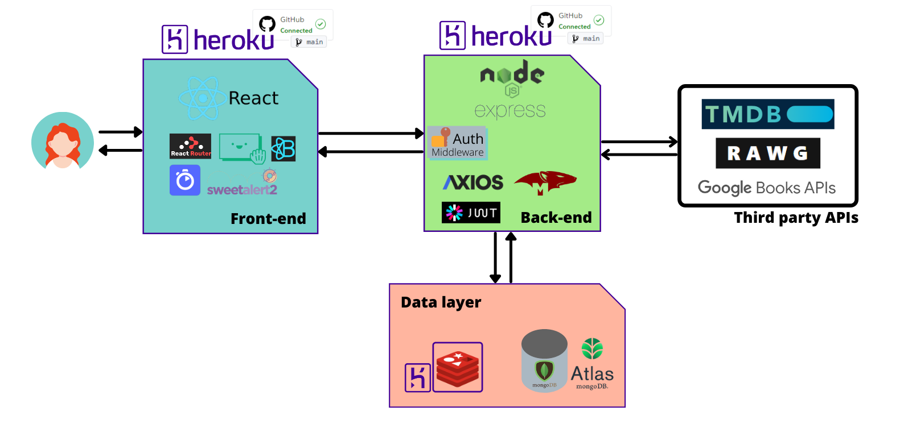

# Agenda-Elobby (frontend) 

Implementación del frontend para el proyecto [Agenda Elobby](https://github.com/lynx-agenda/Agenda-Elobby). ([Elobby-backend](https://github.com/lynx-agenda/Agenda-Elobby-backend/))

Idea: Agenda de ocio, una agenda donde poder **organizar**, **comentar** y **compartir** contenido como películas, series, libros y juegos.

## Deployment

El frontend se encuentra desplegado en Heroku y configurado para desplegarse automáticamente ante cada push que se realice en la rama `main` del proyecto. 

Enlace: [Elobby](https://elobby.herokuapp.com/)

## Technology Stack

El proyecto se implementó utilizando [ReactJS](https://es.reactjs.org/) y utilizando las siguientes teconologías: 

* [algolia](https://www.algolia.com/) 
* [React Router](https://reactrouter.com/) 
* [React Bootstrap](https://react-bootstrap.github.io/)
* [axios](https://github.com/axios/axios)
* [sweetalert2](https://sweetalert2.github.io/) 
* [react-beautiful-dnd](https://github.com/atlassian/react-beautiful-dnd)

## Members

* [@Winki-hub](https://github.com/Winki-hub): FullStack developer
* [@mlordpen](https://github.com/mlordpen): FullStack developer
* [@Kroalca](https://github.com/Kroalca): FullStack developer
* [@gitfrandu4](https://github.com/gitfrandu4): FullStack developer

## Web application architecture

## License

[MIT](https://choosealicense.com/licenses/mit/)
